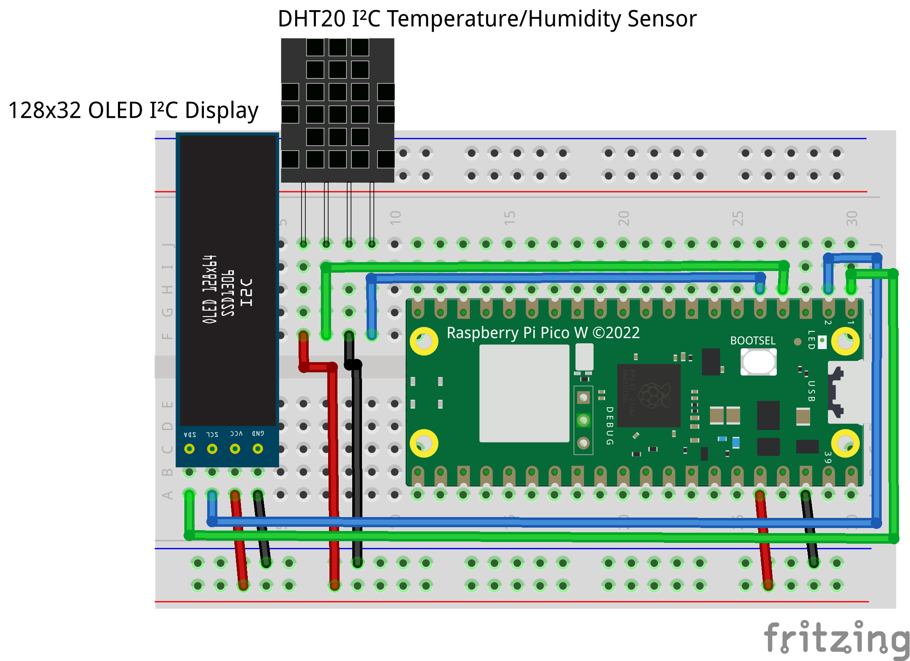

# PicoTemp

An MQTT based Raspberry Pi Pico W smart home temperature/humidity reader using a dht22 sensor, a 10kΩ resitor and a 32x128 OLED readout.

NOTE: **Make sure that you create a `secrets.py` file before running!**

## Circuit

Here is the layout for the circuit.

## Guide

WIP.
